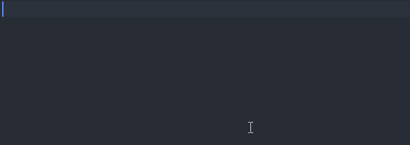

# Rainbow Brackets 2

Multi-color highlight of matching brackets.

This fork is the continuation of original [Rainbow Brackets](https://github.com/gastrodia/rainbow-brackets).

## Features

Resource consumption is much less when compared to the popular and now archived [Bracket Pair Colorizer](https://github.com/CoenraadS/Bracket-Pair-Colorizer-2/).

## Extension Settings

Settings under _Rainbow Brackets 2_ section can be used to:

* Provide custom colors.
* Exclude specific filetypes.